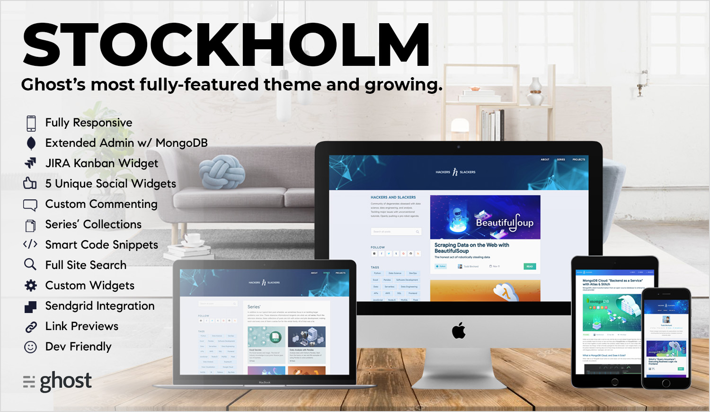
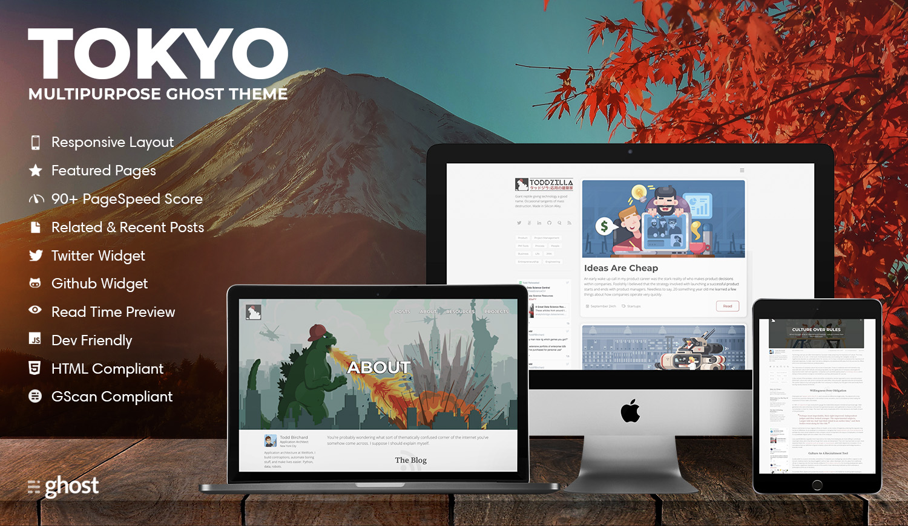
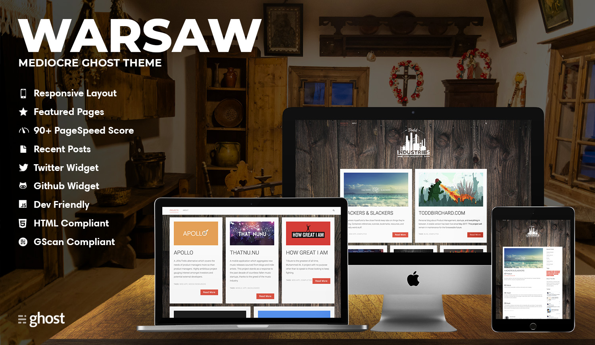

# Ghostthemes.io

Premium themes for the [Ghost](https://ghost.org/) blogging platform.

## Stockholm

[Stockholm](https://github.com/toddbirchard/ghosttheme-stockholm) is arguably the most feature-rich Ghost theme on the market. Users can personalize their themes via simple config files, thus enabling contextual widgets, fully integrated user sign ups, and unique page templates.

------

## Tokyo

[Tokyo](https://github.com/toddbirchard/ghosttheme-tokyo) is a minimalist Ghost theme emphasizing readability, load times, and customization. Stays true to a philosophy of simplicity while expanding on Ghost features to elevate authors.

------

## Warsaw

[Warsaw](https://github.com/toddbirchard/ghosttheme-warsaw) Handcrafted Ghost theme for skilled craftsmen looking to put their work on display.
